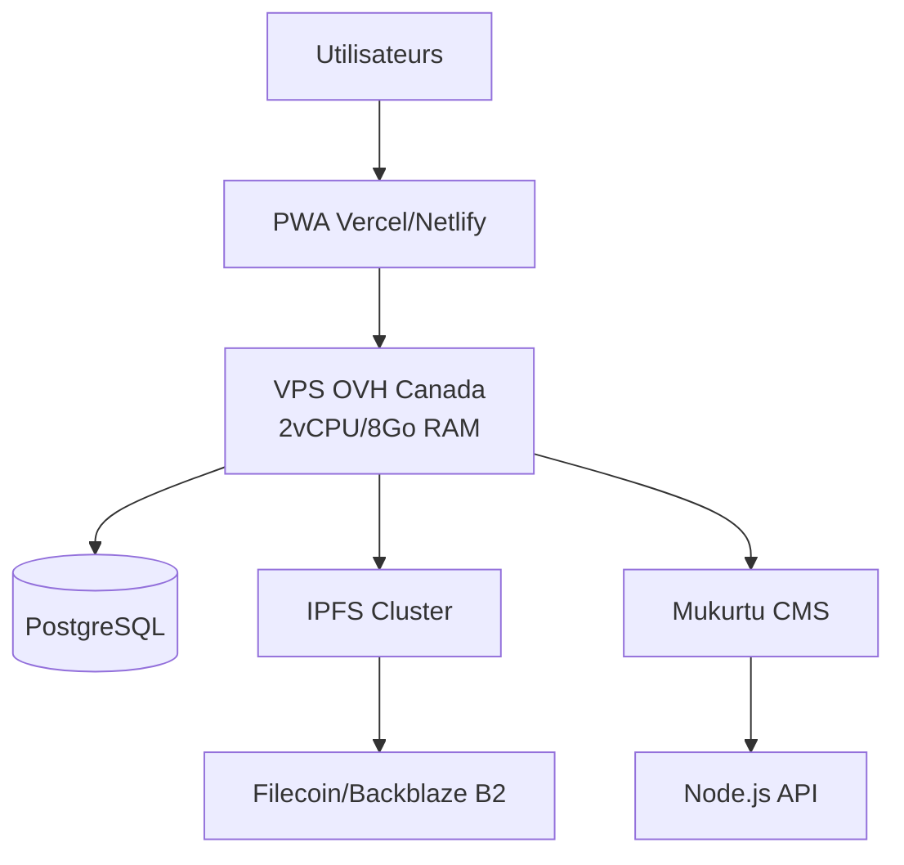

# Architecture technique recommandée – MayaVoiceTranslator (DeepSeek, 2025)

> 🇪🇸 [Versión española disponible](./docs/translations/es/ARQUITECTURA_OVH_MAYA_ES.md)

## Schéma global

## Couches et composants

- **Frontend** : PWA statique (Vercel/Netlify)
- **Backend** : VPS OVH (Node.js, Mukurtu, PostgreSQL, IPFS)
- **Stockage** : IPFS + Backblaze B2 (sauvegardes)
- **Sécurité** : Chiffrement, RLS, audit, protocoles Mukurtu, consentement FPIC

## Points de vigilance

| Risque                | Solution                                      | Outil                     |
|-----------------------|-----------------------------------------------|---------------------------|
| Fuite données         | Chiffrement PostgreSQL, RBAC, RLS             | pgcrypto, policies        |
| Contrôle communautaire| Protocoles Mukurtu, consentement blockchain   | Mukurtu, Hyperledger      |
| Attaques applicatives | Validation, Helmet.js, rate limiting          | Express-Validator         |

## Dimensionnement & coûts

| Composant       | Adéquation      | Recommandation complémentaire       |
|-----------------|-----------------|-------------------------------------|
| CPU/RAM         | ✅ Suffisant    | Monitorer avec Netdata              |
| Stockage SSD    | ⚠️ Limité      | Ajouter Backblaze B2                |
| Bande passante  | ✅ 250Mbps      | Limiter taille uploads audio        |
| **Coût total**  | **≈700€/an**   | VPS + Backblaze + IPFS              |

## Gouvernance

- Comité communautaire, veto sur nouvelles collectes
- Outils Loomio, Hyperledger, checklist OWASP traduite

---

*Voir le guide d’installation pour la mise en œuvre détaillée et la [checklist de conformité](./docs/CHECKLIST_CONFORMITE_OVH.md).*

---

**Checklist de conformité disponible en espagnol : [CHECKLIST_CONFORMIDAD_OVH_ES.md](./docs/translations/es/CHECKLIST_CONFORMIDAD_OVH_ES.md)**
