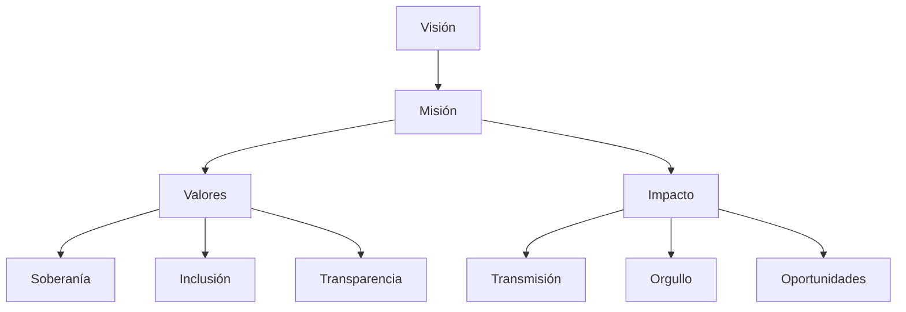
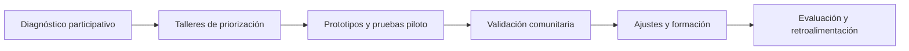
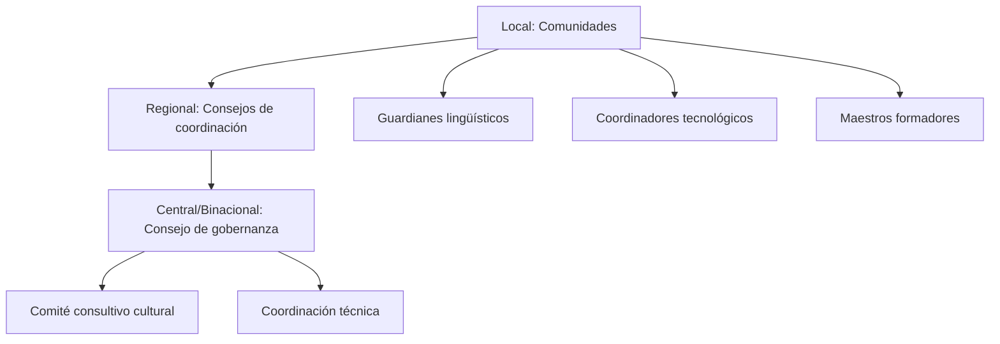
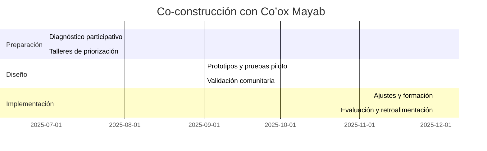
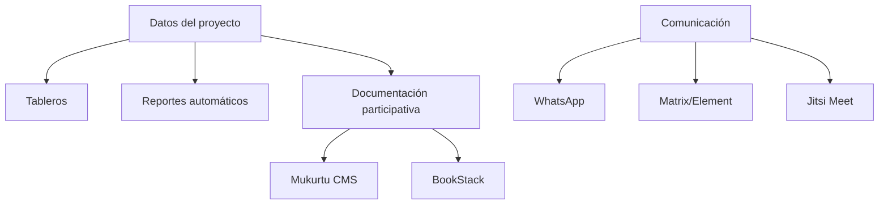
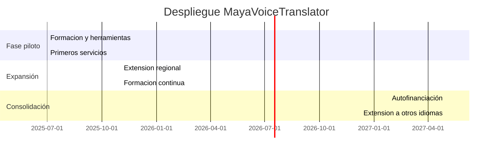
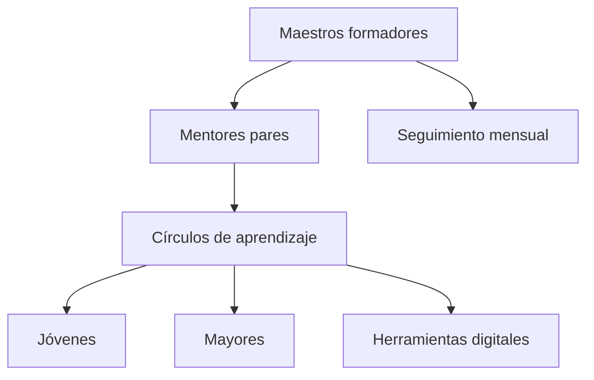
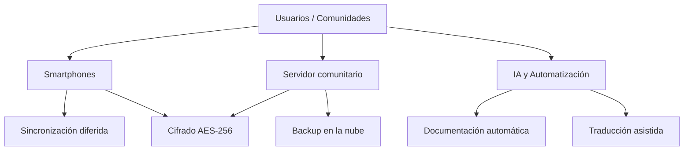

# Manual de Referencia – MayaVoiceTranslator & Co’ox Mayab (ES)

## 1. Visión y objetivos del proyecto
**Misión:** Preservar, valorizar y transmitir las lenguas mayas mediante una plataforma digital ética, inclusiva y soberana, impulsada por y para las comunidades.

**Valores:**
- Soberanía comunitaria sobre los datos y las decisiones
- Respeto a los protocolos culturales y saberes tradicionales
- Inclusión intergeneracional y de género
- Transparencia, reparto de beneficios, gobernanza compartida
- Innovación tecnológica al servicio de la cultura

**¿Por qué este proyecto?**
Las lenguas mayas están en peligro: su preservación es esencial para la diversidad cultural, la identidad y la transmisión de conocimientos. MayaVoiceTranslator busca dar a las comunidades las herramientas para documentar, enseñar y revitalizar sus lenguas, garantizando su autonomía y seguridad.

**Impacto social y cultural:**
- Fortalecimiento del orgullo lingüístico y cultural
- Transmisión de saberes entre generaciones
- Creación de oportunidades educativas y económicas
- Modelo replicable para otras lenguas indígenas
***

(El resto del manual seguirá la misma estructura detallada, sección por sección.)
(El resto del manual seguirá la misma estructura detallada, sección por sección.)

## ANEXOS VISUALES Y TABLAS SINTÉTICAS

### Tabla resumen: Valores y objetivos

| Valor clave                | Objetivo asociado                                      |
|----------------------------|-------------------------------------------------------|
| Soberanía comunitaria      | Autonomía en la gestión y uso de datos                 |
| Respeto cultural           | Protección de saberes y protocolos tradicionales       |
| Inclusión                  | Participación de todas las generaciones y géneros      |
| Transparencia              | Procesos abiertos y rendición de cuentas               |
| Innovación tecnológica     | Herramientas digitales adaptadas a la cultura          |

### Tabla: Roles y responsabilidades

| Rol                              | Función principal                                      |
|-----------------------------------|--------------------------------------------------------|
| Guardianes de los datos           | Supervisión ética y control comunitario de los datos    |
| Coordinadores IA/automatización   | Configuración y soporte de herramientas digitales       |
| Maestros formadores y mentores    | Formación y acompañamiento intergeneracional           |

### Tabla: Herramientas principales y su función

| Herramienta         | Función principal                                 |
|---------------------|---------------------------------------------------|
| O-lab               | Aprendizaje offline, documentación comunitaria    |
| Mukurtu CMS         | Gestión de archivos y derechos culturales         |
| BookStack           | Wiki colaborativo, guías prácticas                |
| WhatsApp/Matrix     | Comunicación segura y accesible                   |
| Jitsi Meet          | Videoconferencias                                |
| Google Drive        | Almacenamiento sencillo y compartido              |

### Tabla: Indicadores de éxito de la formación

| Indicador                        | Meta alcanzable      |
|----------------------------------|----------------------|
| Autonomía con smartphone         | 90%                  |
| Grabaciones conformes            | 80%                  |
| Resolución autónoma de problemas | 75%                  |

### Tabla: Presupuesto previsto (año 1)

| Concepto                | Monto (USD) |
|-------------------------|-------------|
| Formación y capacitación| 10 000      |
| Coordinación regional   | 7 000       |
| Infraestructura técnica | 3 000       |
| Documentación/evaluación| 3 000       |
| Reserva/emergencias     | 2 000       |
| **Total**               | **25 000**  |

### Tabla: Indicadores de éxito

| Indicador                        | Meta mínima         |
|----------------------------------|---------------------|
| Miembros activos por región      | 100+                |
| Horas de grabaciones             | 500+                |
| Facilitadores certificados       | 50+                 |
| Usuarios mensuales               | 1 000+              |
| Retención de voluntarios (6m)    | 75%                 |

### Tabla: Herramientas de transparencia y comunicación

| Herramienta         | Uso principal                                 |
|---------------------|-----------------------------------------------|
| Tableros públicos   | Seguimiento de progreso y presupuesto          |
| Informes automáticos| Difusión de resultados y avances               |
| Mukurtu CMS         | Documentación participativa y cultural         |
| BookStack           | Wiki colaborativo                             |
| WhatsApp/Matrix     | Comunicación interna y externa                |
| Jitsi Meet          | Reuniones y asambleas virtuales               |

### Ejemplo visual: Proceso de co-construcción

### Tabla: Glosario visual

| Término         | Definición breve                                      |
|-----------------|------------------------------------------------------|
| OCAP/CARE       | Principios de control y acceso comunitario a los datos|
| Mukurtu CMS     | Plataforma de archivos digitales indígenas            |
| FirstVoices     | Plataforma de revitalización lingüística              |
| O-lab           | Herramienta de aprendizaje offline                   |
| BookStack       | Wiki colaborativo open source                        |
| IA              | Inteligencia artificial                              |

# 2. Gobernanza y organización

## Estructura de gobernanza híbrida
El modelo de gobernanza de MayaVoiceTranslator & Co’ox Mayab se inspira en las mejores prácticas observadas en proyectos indígenas internacionales (FirstVoices, Mukurtu CMS, Pueblos Mancomunados, Inclusive Conservation Initiative del GEF, Harvard Project on American Indian Economic Development).

### Tres niveles de gobernanza
- **Local**: Asambleas comunitarias, guardianes lingüísticos, coordinadores tecnológicos voluntarios. Validación cultural y animación local.
- **Regional**: Consejos regionales de coordinación (por estado/región), 3-5 representantes elegidos, reuniones mensuales (virtuales o presenciales). Adaptación a las realidades locales.
- **Central/Binacional**: Consejo de gobernanza híbrido (México-Guatemala), comité consultivo cultural (derecho de veto en cuestiones sensibles), coordinación técnica (expertos en IA, socios técnicos).

### Procesos de decisión
- **Sociocracia adaptada**: Propuestas traducidas, consulta a autoridades tradicionales, consentimiento comunitario, periodo de prueba y revisión.
- **Derecho de veto cultural**: Para la gestión de saberes sagrados, propiedad de los datos, representación cultural.

### Roles y responsabilidades
- **Guardianes de los datos comunitarios**: Aplicación de los principios OCAP/CARE, supervisión del uso ético de los datos.
- **Coordinadores IA/automatización**: Configuración y mantenimiento de herramientas digitales, formación de voluntarios.
- **Maestros formadores y mentores**: Formación intergeneracional, acompañamiento de facilitadores locales.

**Fuentes e inspiraciones**:
- Experiencias de co-diseño participativo en proyectos indígenas (O-lab, Mukurtu CMS, FirstVoices, Co’ox Mayab).

# 9. Preguntas frecuentes (FAQ) y glosario

## Preguntas frecuentes (FAQ)

**¿Quién puede participar en el proyecto?**
Cualquier miembro de las comunidades mayas interesadas, sin distinción de edad, género o nivel educativo.

**¿Cómo se protege la privacidad y la propiedad de los datos?**
Los datos son gestionados bajo principios OCAP/CARE, con control comunitario, cifrado y protocolos de consentimiento cultural.

**¿Qué herramientas se utilizan y por qué?**
Se priorizan herramientas open source, adaptadas a contextos rurales y multilingües, con soporte offline y control comunitario.

**¿Cómo se financia el proyecto?**
Mediante subvenciones, crowdfunding, servicios lingüísticos y alianzas estratégicas.

**¿Cómo se mide el éxito del proyecto?**
Por la participación activa, la cantidad y calidad de los contenidos documentados, la autonomía tecnológica y la sostenibilidad a largo plazo.

## Glosario

- **OCAP/CARE**: Principios de propiedad, control, acceso y posesión de datos por las comunidades indígenas.
- **Mukurtu CMS**: Plataforma open source para la gestión de archivos digitales indígenas.
- **FirstVoices**: Plataforma canadiense para la revitalización de lenguas indígenas.
- **O-lab**: Herramienta de aprendizaje offline y documentación comunitaria.
- **BookStack**: Wiki colaborativo open source.
- **IA**: Inteligencia artificial.

**Este manual es un documento vivo y será actualizado según las aportaciones de los socios comunitarios y la evolución del proyecto.**
- Mukurtu CMS, BookStack, FirstVoices, prácticas de transparencia comunitaria Co’ox Mayab.

# 8. Puntos a co-construir con Co’ox Mayab

## Temas abiertos y procesos de co-construcción
Esta sección identifica los puntos clave que requieren diálogo, validación y co-diseño con los socios comunitarios de Co’ox Mayab, para asegurar la pertinencia, apropiación y sostenibilidad del proyecto.

### Temas a definir en conjunto
- Priorización de idiomas y variantes a documentar y revitalizar
- Protocolos culturales y de consentimiento para el uso y difusión de datos
- Mecanismos de gobernanza y toma de decisiones adaptados a cada comunidad
- Estrategias de formación y acompañamiento según las realidades locales
- Modelos de sostenibilidad económica y alianzas estratégicas
- Indicadores de éxito y mecanismos de evaluación participativa

### Proceso de co-construcción
El proceso se basa en talleres participativos, consultas comunitarias, pruebas piloto y validación continua, asegurando la inclusión de todas las voces (jóvenes, mayores, mujeres, autoridades tradicionales).

**Ejemplo de cronograma de co-construcción:**

**Fuentes e inspiraciones**:
- Experiencias de co-diseño participativo en proyectos indígenas (O-lab, Mukurtu CMS, FirstVoices, Co’ox Mayab).
- FirstVoices, Inclusive Conservation Initiative, experiencias de despliegue comunitario Co’ox Mayab.

# 7. Transparencia, documentación y comunicación

## Herramientas de transparencia y documentación participativa
El proyecto se apoya en herramientas open source y procesos participativos, inspirados en Mukurtu CMS, BookStack, FirstVoices y las prácticas de Co’ox Mayab.

### Tableros públicos y reportes
- Tableros generados automáticamente (progreso, presupuesto, participación)
- Informes trimestrales automatizados, multilingües, difundidos por WhatsApp/Telegram
- Asambleas comunitarias para presentación oral y validación

### Documentación participativa
- Mukurtu CMS: gestión de derechos culturales, etiquetas TK Labels, acceso offline, navegación visual
- BookStack: wiki colaborativo, guías prácticas
- Soportes audio/vídeo para la inclusión de no lectores

### Comunicación interna y externa
- WhatsApp, Matrix/Element: mensajería segura
- Jitsi Meet: videoconferencias
- Talleres y reuniones regulares (virtuales o presenciales)

**Fuentes e inspiraciones**:
- Mukurtu CMS, BookStack, FirstVoices, prácticas de transparencia comunitaria Co’ox Mayab.
- First Peoples’ Cultural Council (Canadá), modelos de cooperativas lingüísticas, experiencias de Co’ox Mayab, proyectos UNESCO/FILAC.

# 6. Despliegue y calendario

## Fases del proyecto e indicadores de éxito
El despliegue sigue una hoja de ruta progresiva, inspirada en los modelos de FirstVoices, Inclusive Conservation Initiative y las experiencias de Co’ox Mayab.

### Fases del proyecto
- **Fase piloto (6 meses, 500 usuarios)**: adaptación O-lab, formación de los primeros instructores, primeros servicios de traducción, instalación de Mukurtu CMS
- **Expansión (3 años, 5 000 usuarios)**: extensión técnica, formación, operaciones, investigación, extensión regional (Yucatán, luego Chiapas, Quintana Roo, Campeche, Guatemala)
- **Consolidación (después de 3 años)**: autofinanciación parcial, extensión a otros idiomas, sostenibilidad de la gobernanza

### Hitos clave
- Instalación de herramientas (O-lab, Mukurtu CMS)
- Certificación de formadores
- Creación de los primeros archivos digitales comunitarios
- Lanzamiento de servicios lingüísticos
- Logro de indicadores de autonomía y participación

### Indicadores de éxito
- 100+ miembros activos por región
- 500+ horas de grabaciones
- 50+ facilitadores certificados
- 1 000+ usuarios mensuales
- 75% de retención de voluntarios tras 6 meses

**Fuentes e inspiraciones**:
- FirstVoices, Inclusive Conservation Initiative, experiencias de despliegue comunitario Co’ox Mayab.
- O-lab (El Origen Foundation), IYMP (Canadá), CONALFA (Guatemala), Mukurtu CMS, experiencias de formación comunitaria en América Latina.

# 5. Modelo económico y financiación

## Presupuesto, fuentes de ingresos y resiliencia financiera
El modelo económico se inspira en la economía solidaria, las cooperativas lingüísticas (First Peoples’ Cultural Council, Canadá) y las experiencias de Co’ox Mayab.

### Presupuesto previsto (año 1)
- Formación y capacitación: 10 000 $
- Coordinación regional: 7 000 $
- Infraestructura técnica: 3 000 $
- Documentación/evaluación: 3 000 $
- Reserva/emergencias: 2 000 $
- **Total: 25 000 $**

### Fuentes de ingresos
- Subvenciones (UNESCO, FILAC, fundaciones)
- Crowdfunding (diáspora maya)
- Servicios de traducción/interpretación, formación, consultoría cultural
- Alianzas universitarias y tecnológicas

### Estrategias de resiliencia
- Plataformas open source para reducir costes (Mukurtu, FirstVoices, ReadAlong Studio)
- Automatización de tareas (IA, flujos de trabajo)
- Mutualización de recursos entre cooperativas
- Compromiso de la diáspora (microdonaciones, eventos virtuales)

```mermaid
flowchart TD
    Presupuesto["Presupuesto anual"] --> Formacion["Formación"]
    Presupuesto --> Coordinacion["Coordinación regional"]
    Presupuesto --> Tecnica["Infraestructura técnica"]
    Presupuesto --> Documentacion["Documentación"]
    Presupuesto --> Reserva["Reserva"]
    Ingresos["Fuentes de ingresos"] --> Subvenciones["Subvenciones"]
    Ingresos --> Crowdfunding["Crowdfunding diáspora"]
    Ingresos --> Servicios["Servicios lingüísticos"]
    Ingresos --> Alianzas["Alianzas"]
    Estrategia["Estrategias de resiliencia"] --> OpenSource["Open source"]
    Estrategia --> Automatizacion["Automatización"]
    Estrategia --> Mutualizacion["Mutualización"]
    Estrategia --> Diaspora["Diáspora"]
```

**Fuentes e inspiraciones**:
- First Peoples’ Cultural Council (Canadá), modelos de cooperativas lingüísticas, experiencias de Co’ox Mayab, proyectos UNESCO/FILAC.
- FirstVoices, Mukurtu CMS, MooseFS, Ceph, O-lab, ReadAlong Studio, experiencias de campo en zonas rurales y multilingües.

# 4. Formación y acompañamiento

## Programa de formación y metodología intergeneracional
El programa de formación se basa en el enfoque “formar a los formadores” y el mentorazgo intergeneracional, validados en proyectos como O-lab (Colombia), IYMP (Canadá), CONALFA (Guatemala) y Mukurtu CMS.

### Etapas del programa
- **Fase 1: Fundación** – Formación intensiva de 3-5 días con un experto externo, luego sesiones mensuales de seguimiento. Competencias básicas: uso de smartphone, grabación de audio, gestión de archivos.
- **Fase 2: Documentación lingüística** – Creación de contenido audiovisual, transcripción, uso de herramientas digitales sencillas (O-lab, WhatsApp, Google Drive).
- **Fase 3: Gestión de datos** – Respaldo en la nube, organización de archivos, anonimización, gestión de accesos.

### Metodología
- **Mentorazgo intergeneracional**: los jóvenes forman a los mayores, reconocimiento formal de los facilitadores (certificados, valoración comunitaria)
- **Círculos de aprendizaje**: grupos de 5-7 personas, mezclando generaciones y perfiles
- **Sesiones adaptadas**: microaprendizaje, juegos digitales, integración en actividades comunitarias

### Herramientas y soportes
- O-lab (aprendizaje offline), Mukurtu CMS (documentación), WhatsApp (comunicación), materiales impresos y audio

### Indicadores de éxito
- 90% de autonomía con smartphone, 80% de grabaciones conformes, 75% de resolución autónoma de problemas

**Fuentes e inspiraciones**:
- O-lab (El Origen Foundation), IYMP (Canadá), CONALFA (Guatemala), Mukurtu CMS, experiencias de formación comunitaria en América Latina.
- FirstVoices (Canadá), Mukurtu CMS (Australia/EEUU), Pueblos Mancomunados (México), Inclusive Conservation Initiative (GEF), Harvard Project on American Indian Economic Development.
- Experiencias directas de Co’ox Mayab en gobernanza comunitaria y coordinación intercooperativa.

# 3. Funcionamiento técnico

## Arquitectura técnica y seguridad
El proyecto se basa en una arquitectura distribuida, robusta y económica, inspirada en soluciones probadas en proyectos lingüísticos indígenas (FirstVoices, Mukurtu CMS, MooseFS, Ceph, O-lab, ReadAlong Studio).

### Almacenamiento y sincronización
- **Almacenamiento local principal** (edge computing) en smartphones y servidores comunitarios
- **Sincronización diferida** con servidores regionales y copias de seguridad en la nube (triple replicación, versionado)
- **Cifrado AES-256** y gestión de claves por las comunidades

### Automatización e IA
- Uso de IA (Copilot, Claude, Deepseek) para automatizar tareas, traducción, generación de informes y documentación
- Automatización de flujos de trabajo (Huginn, n8n), soporte técnico por chatbot

### Gestión de datos (OCAP, CARE)
- Propiedad, control, acceso y posesión comunitaria de los datos
- Protocolos de consentimiento cultural, gestión de accesos por roles
- Anonimización y seudonimización para contenidos sensibles

### Seguridad multicapa
- Cifrado nativo Android, copias de seguridad incrementales, control de acceso granular
- Protocolos de seguridad adaptados a realidades locales (conexión intermitente, zonas sin cobertura)

### Herramientas utilizadas
- **O-lab** (aprendizaje offline en smartphones)
- **Mukurtu CMS** (documentación participativa, gestión de derechos culturales)
- **WhatsApp, Google Drive** (comunicación, almacenamiento sencillo)
- **BookStack, Jitsi Meet, Matrix/Element** (documentación, videoconferencia, mensajería segura)

**Fuentes e inspiraciones**:
- FirstVoices, Mukurtu CMS, MooseFS, Ceph, O-lab, ReadAlong Studio, experiencias de campo en zonas rurales y multilingües.
- FirstVoices (Canadá), Mukurtu CMS (Australia/EEUU), Pueblos Mancomunados (México), Inclusive Conservation Initiative (GEF), Harvard Project on American Indian Economic Development.
- Experiencias directas de Co’ox Mayab en gobernanza comunitaria y coordinación intercooperativa.
