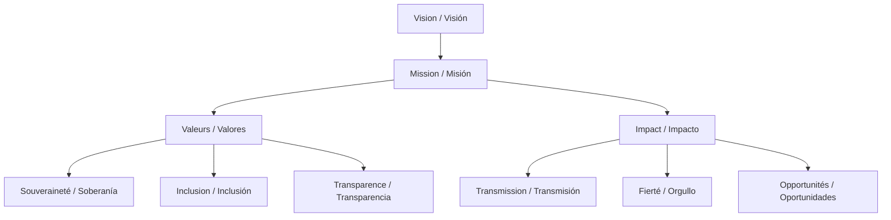

# Manuel de Référence Bilingue / Manual de Referencia Bilingüe

## 1. Vision et objectifs du projet / Visión y objetivos del proyecto

### FR :
**Mission :** Préserver, valoriser et transmettre les langues mayas à travers une plateforme numérique éthique, inclusive et souveraine, portée par et pour les communautés.

**Valeurs :**
- Souveraineté communautaire sur les données et les décisions
- Respect des protocoles culturels et des savoirs traditionnels
- Inclusion intergénérationnelle et de genre
- Transparence, partage des bénéfices, gouvernance partagée
- Innovation technologique au service de la culture

**Pourquoi ce projet ?**
Les langues mayas sont en danger : leur préservation est essentielle pour la diversité culturelle, l’identité et la transmission des savoirs. MayaVoiceTranslator vise à donner aux communautés les outils pour documenter, enseigner et faire vivre leurs langues, tout en garantissant leur autonomie et leur sécurité.

**Impact social et culturel :**
- Renforcement de la fierté linguistique et culturelle
- Transmission des savoirs entre générations
- Création d’opportunités éducatives et économiques
- Modèle reproductible pour d’autres langues autochtones

### ES :
**Misión:** Preservar, valorizar y transmitir las lenguas mayas mediante una plataforma digital ética, inclusiva y soberana, impulsada por y para las comunidades.

**Valores:**
- Soberanía comunitaria sobre los datos y las decisiones
- Respeto a los protocolos culturales y saberes tradicionales
- Inclusión intergeneracional y de género
- Transparencia, reparto de beneficios, gobernanza compartida
- Innovación tecnológica al servicio de la cultura

**¿Por qué este proyecto?**
Las lenguas mayas están en peligro: su preservación es esencial para la diversidad cultural, la identidad y la transmisión de conocimientos. MayaVoiceTranslator busca dar a las comunidades las herramientas para documentar, enseñar y revitalizar sus lenguas, garantizando su autonomía y seguridad.

**Impacto social y cultural:**
- Fortalecimiento del orgullo lingüístico y cultural
- Transmisión de saberes entre generaciones
- Creación de oportunidades educativas y económicas
- Modelo replicable para otras lenguas indígenas

---

## 2. Gouvernance et organisation / Gobernanza y organización
- **FR** : Structure de gouvernance hybride (local, régional, central). Rôles et responsabilités. Processus de décision (sociocratie, droit de veto, validation culturelle)
- **ES** : Estructura de gobernanza híbrida (local, regional, central). Roles y responsabilidades. Procesos de decisión (sociocracia, derecho de veto, validación cultural)

## 3. Fonctionnement technique / Funcionamiento técnico
- **FR** : Architecture technique (stockage, sécurité, synchronisation, outils utilisés). Automatisation et rôle des IA. Gestion des données (OCAP, CARE, souveraineté, anonymisation). Sécurité multicouche et protocoles de sauvegarde
- **ES** : Arquitectura técnica (almacenamiento, seguridad, sincronización, herramientas utilizadas). Automatización y rol de las IA. Gestión de datos (OCAP, CARE, soberanía, anonimización). Seguridad multicapa y protocolos de respaldo

## 4. Formation et accompagnement / Formación y acompañamiento
- **FR** : Programme “former les formateurs”. Outils et applications (O-lab, Mukurtu CMS, WhatsApp, etc.). Méthodologie intergénérationnelle et reconnaissance des facilitateurs
- **ES** : Programa "formar a los formadores". Herramientas y aplicaciones (O-lab, Mukurtu CMS, WhatsApp, etc.). Metodología intergeneracional y reconocimiento de facilitadores

## 5. Modèle économique et financement / Modelo económico y financiamiento
- **FR** : Budget prévisionnel (phases pilote et expansion). Sources de revenus (services, formation, diaspora, subventions). Stratégies de résilience financière
- **ES** : Presupuesto previsto (fases piloto y expansión). Fuentes de ingresos (servicios, formación, diáspora, subvenciones). Estrategias de resiliencia financiera

## 6. Déploiement et calendrier / Despliegue y calendario
- **FR** : Phases du projet (pilote, expansion, consolidation). Jalons clés et indicateurs de succès. Plan d’expansion régionale
- **ES** : Fases del proyecto (piloto, expansión, consolidación). Hitos clave e indicadores de éxito. Plan de expansión regional

## 7. Transparence, documentation et communication / Transparencia, documentación y comunicación
- **FR** : Tableaux de bord publics, rapports automatiques. Documentation participative (Mukurtu, wiki, guides). Communication interne et externe (WhatsApp, réunions, ateliers)
- **ES** : Tableros públicos, informes automáticos. Documentación participativa (Mukurtu, wiki, guías). Comunicación interna y externa (WhatsApp, reuniones, talleres)

## 8. Points à co-construire avec Co’ox Mayab / Puntos a co-construir con Co’ox Mayab
- **FR** : Questions ouvertes (partage des bénéfices, modalités de formation, adaptation culturelle…). Espaces de décision partagée
- **ES** : Preguntas abiertas (reparto de beneficios, modalidades de formación, adaptación cultural…). Espacios de decisión compartida

## 9. FAQ et lexique / Preguntas frecuentes y glosario
- **FR** : Réponses aux questions fréquentes (sécurité, maintenance, gouvernance…). Définitions des termes techniques et organisationnels
- **ES** : Respuestas a preguntas frecuentes (seguridad, mantenimiento, gobernanza…). Definiciones de términos técnicos y organizacionales

---

Chaque section sera développée en détail, en français et en espagnol, pour garantir la compréhension et l’inclusion de tous les membres de Co’ox Mayab et des partenaires. / Cada sección se desarrollará en detalle, en francés y en español, para garantizar la comprensión y la inclusión de todos los miembros de Co’ox Mayab y los socios.
