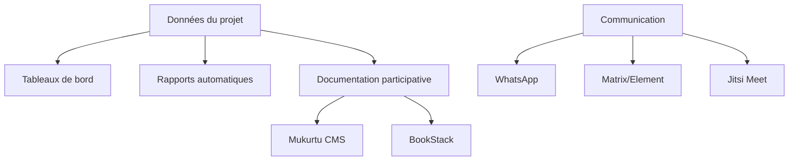
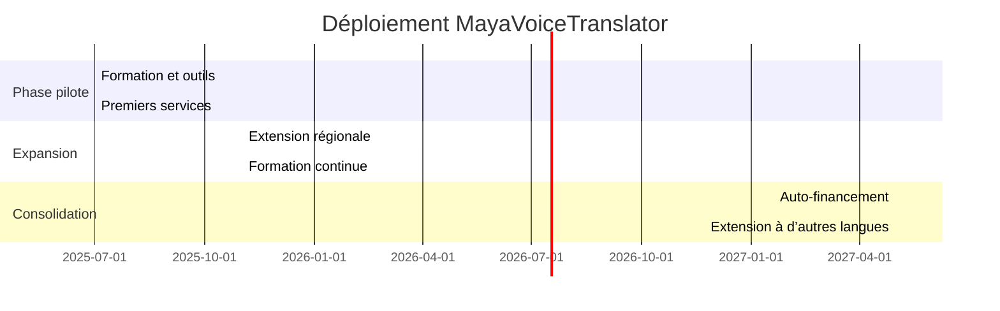
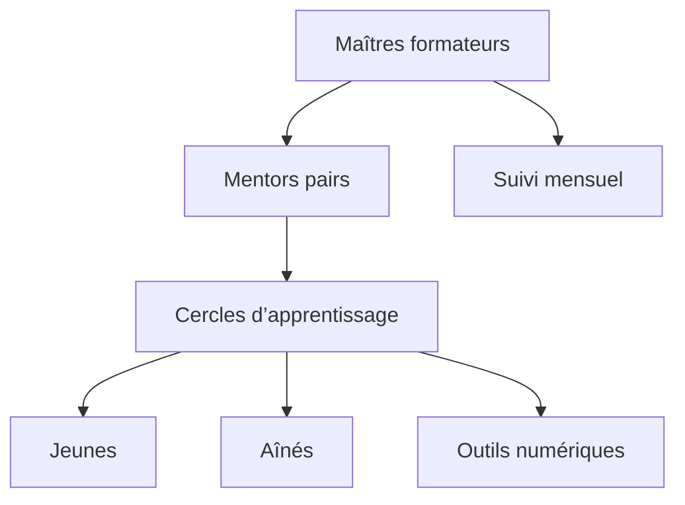
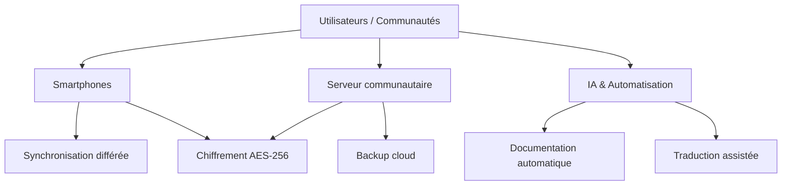
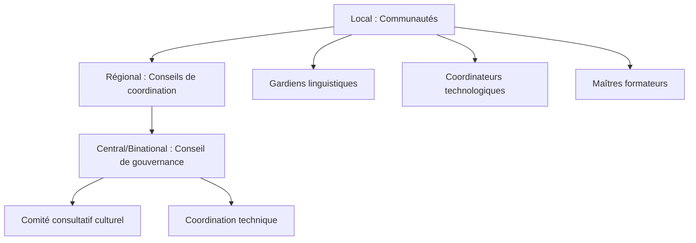
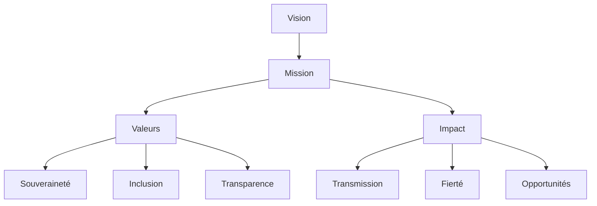

```mermaid
flowchart TD
    Budget["Budget annuel"] --> Formation["Formation"]
    Budget --> Coordination["Coordination régionale"]
    Budget --> Technique["Infrastructure technique"]
    Budget --> Documentation["Documentation"]
    Budget --> Reserve["Réserve"]
    Revenus["Sources de revenus"] --> Subventions["Subventions"]
    Revenus --> Crowdfunding["Crowdfunding diaspora"]
    Revenus --> Services["Services linguistiques"]
    Revenus --> Partenariats["Partenariats"]
    Strategie["Stratégies de résilience"] --> OpenSource["Open source"]
    Strategie --> Automatisation["Automatisation"]
    Strategie --> Mutualisation["Mutualisation"]
    Strategie --> Diaspora["Diaspora"]
```

# 7. Transparence, documentation et communication

## Outils de transparence et documentation participative
Le projet s’appuie sur des outils open source et des processus participatifs, inspirés de Mukurtu CMS, BookStack, FirstVoices, et des pratiques de Co’ox Mayab.

### Tableaux de bord publics et rapports
- Tableaux de bord générés automatiquement (progrès, budget, participation)
- Rapports trimestriels automatisés, multilingues, diffusés via WhatsApp/Telegram
- Assemblées communautaires pour présentation orale et validation

### Documentation participative
- Mukurtu CMS : gestion des droits culturels, étiquettes TK Labels, accès offline, navigation visuelle
- BookStack : wiki collaboratif, guides pratiques
- Supports audio/vidéo pour l’inclusion des non-lecteurs

### Communication interne et externe
- WhatsApp, Matrix/Element : messagerie sécurisée
- Jitsi Meet : visioconférences
- Ateliers et réunions régulières (virtuelles ou physiques)

---

**Sources et inspirations** :
- Mukurtu CMS, BookStack, FirstVoices, pratiques de transparence communautaire Co’ox Mayab.
# 6. Déploiement et calendrier

## Phases du projet et indicateurs de succès
Le déploiement suit une feuille de route progressive, inspirée des modèles de FirstVoices, Inclusive Conservation Initiative, et des expériences de Co’ox Mayab.

### Phases du projet
- **Phase pilote (6 mois, 500 utilisateurs)** : adaptation O-lab, formation des premiers instructeurs, premiers services de traduction, installation Mukurtu CMS
- **Expansion (3 ans, 5 000 utilisateurs)** : extension technique, formation, opérations, recherche, extension régionale (Yucatán, puis Chiapas, Quintana Roo, Campeche, Guatemala)
- **Consolidation (après 3 ans)** : auto-financement partiel, extension à d’autres langues, pérennisation de la gouvernance

### Jalons clés
- Installation des outils (O-lab, Mukurtu CMS)
- Certification des formateurs
- Création des premières archives numériques communautaires
- Lancement des services linguistiques
- Atteinte des indicateurs d’autonomie et de participation

### Indicateurs de succès
- 100+ membres actifs par région
- 500+ heures d’enregistrements
- 50+ facilitateurs certifiés
- 1 000+ utilisateurs mensuels
- 75% de rétention des bénévoles après 6 mois

---

**Sources et inspirations** :
- FirstVoices, Inclusive Conservation Initiative, expériences de déploiement communautaire Co’ox Mayab.
# 5. Modèle économique et financement

## Budget, sources de revenus et résilience financière
Le modèle économique s’inspire de l’économie solidaire, des coopératives linguistiques (First Peoples’ Cultural Council, Canada), et des expériences de Co’ox Mayab.

### Budget prévisionnel (année 1)
- Formation et capacitation : 10 000 $
- Coordination régionale : 7 000 $
- Infrastructure technique : 3 000 $
- Documentation/évaluation : 3 000 $
- Réserve/urgences : 2 000 $
- **Total : 25 000 $**

### Sources de revenus
- Subventions (UNESCO, FILAC, fondations)
- Crowdfunding (diaspora maya)
- Services de traduction/interprétation, formation, consultation culturelle
- Partenariats universitaires et technologiques

### Stratégies de résilience
- Plateformes open source pour réduire les coûts (Mukurtu, FirstVoices, ReadAlong Studio)
- Automatisation des tâches (IA, workflows)
- Mutualisation des ressources entre coopératives
- Engagement de la diaspora (micro-dons, événements virtuels)

---

**Sources et inspirations** :
- First Peoples’ Cultural Council (Canada), modèles de coopératives linguistiques, expériences de Co’ox Mayab, projets UNESCO/FILAC.
# 4. Formation et accompagnement

## Programme de formation et méthodologie intergénérationnelle
Le programme de formation s’appuie sur l’approche “former les formateurs” et le mentorat intergénérationnel, validés dans des projets comme O-lab (Colombie), IYMP (Canada), CONALFA (Guatemala), et Mukurtu CMS.

### Étapes du programme
- **Phase 1 : Fondation** – Formation intensive de 3-5 jours avec un expert externe, puis sessions mensuelles de suivi. Compétences de base : navigation smartphone, enregistrement audio, gestion de fichiers.
- **Phase 2 : Documentation linguistique** – Création de contenu audio/vidéo, transcription, utilisation d’outils numériques simples (O-lab, WhatsApp, Google Drive).
- **Phase 3 : Gestion des données** – Sauvegarde cloud, organisation des archives, anonymisation, gestion des accès.

### Méthodologie
- **Mentorat intergénérationnel** : les jeunes forment les aînés, reconnaissance formelle des facilitateurs (certificats, valorisation communautaire)
- **Cercles d’apprentissage** : groupes de 5-7 personnes, mélangeant générations et profils
- **Sessions adaptées** : micro-apprentissage, jeux numériques, intégration dans les activités communautaires

### Outils et supports
- O-lab (apprentissage offline), Mukurtu CMS (documentation), WhatsApp (communication), supports papier et audio

### Indicateurs de réussite
- 90% d’autonomie smartphone, 80% d’enregistrements conformes, 75% de résolution autonome des problèmes

---

**Sources et inspirations** :
- O-lab (El Origen Foundation), IYMP (Canada), CONALFA (Guatemala), Mukurtu CMS, expériences de formation communautaire en Amérique latine.
# 3. Fonctionnement technique

## Architecture technique et sécurité
Le projet s’appuie sur une architecture distribuée, robuste et économique, inspirée de solutions éprouvées dans les projets linguistiques autochtones (FirstVoices, Mukurtu CMS, MooseFS, Ceph, O-lab, ReadAlong Studio).

### Stockage et synchronisation
- **Stockage local principal** (edge computing) sur smartphones et serveurs communautaires
- **Synchronisation différée** avec serveurs régionaux et backups cloud (triple réplication, versioning)
- **Chiffrement AES-256** et gestion des clés par les communautés

### Automatisation et IA
- Utilisation d’IA (Copilot, Claude, Deepseek) pour l’automatisation des tâches, la traduction, la génération de rapports, la documentation
- Automatisation des workflows (Huginn, n8n), support technique par chatbot

### Gestion des données (OCAP, CARE)
- Propriété, contrôle, accès et possession communautaires des données
- Protocoles de consentement culturel, gestion des accès par rôles
- Anonymisation et pseudonymisation pour les contenus sensibles

### Sécurité multicouche
- Chiffrement natif Android, sauvegardes incrémentielles, contrôle d’accès granulaire
- Protocoles de sécurité adaptés aux réalités locales (connexion intermittente, zones blanches)

### Outils utilisés
- **O-lab** (apprentissage offline sur smartphones)
- **Mukurtu CMS** (documentation participative, gestion des droits culturels)
- **WhatsApp, Google Drive** (communication, stockage simple)
- **BookStack, Jitsi Meet, Matrix/Element** (documentation, visioconférence, messagerie sécurisée)

---

**Sources et inspirations** :
- FirstVoices, Mukurtu CMS, MooseFS, Ceph, O-lab, ReadAlong Studio, expériences de terrain en zones rurales et multilingues.
# 2. Gouvernance et organisation

## Structure de gouvernance hybride
Le modèle de gouvernance de MayaVoiceTranslator & Co’ox Mayab s’inspire des meilleures pratiques observées dans des projets autochtones internationaux (FirstVoices, Mukurtu CMS, Pueblos Mancomunados, Inclusive Conservation Initiative du GEF, Harvard Project on American Indian Economic Development).

### Trois niveaux de gouvernance
- **Local** : Assemblées communautaires, gardiens linguistiques, coordinateurs technologiques bénévoles. Validation culturelle et animation locale.
- **Régional** : Conseils régionaux de coordination (par État/région), 3-5 représentants élus, réunions mensuelles (virtuelles ou physiques). Adaptation aux réalités locales.
- **Central/Binational** : Conseil de gouvernance hybride (Mexique-Guatemala), comité consultatif culturel (droit de veto sur les questions sensibles), coordination technique (experts IA, partenaires techniques).

### Processus de décision
- **Sociocratie adaptée** : Propositions traduites, consultation des autorités traditionnelles, consentement communautaire, période d’essai et révision.
- **Droit de veto culturel** : Pour la gestion des savoirs sacrés, la propriété des données, la représentation culturelle.

### Rôles et responsabilités
- **Gardiens des données communautaires** : Application des principes OCAP/CARE, supervision de l’utilisation éthique des données.
- **Coordinateurs IA/automatisation** : Configuration et maintenance des outils numériques, formation des bénévoles.
- **Maîtres formateurs et mentors** : Formation intergénérationnelle, accompagnement des facilitateurs locaux.

---

**Sources et inspirations** :
- FirstVoices (Canada), Mukurtu CMS (Australie/USA), Pueblos Mancomunados (Mexique), Inclusive Conservation Initiative (GEF), Harvard Project on American Indian Economic Development.
- Expériences directes de Co’ox Mayab en gouvernance communautaire et coordination inter-coopérative.
# Manuel de Référence – MayaVoiceTranslator & Co’ox Mayab (FR)

## 1. Vision et objectifs du projet
**Mission :** Préserver, valoriser et transmettre les langues mayas à travers une plateforme numérique éthique, inclusive et souveraine, portée par et pour les communautés.

**Valeurs :**
- Souveraineté communautaire sur les données et les décisions
- Respect des protocoles culturels et des savoirs traditionnels
- Inclusion intergénérationnelle et de genre
- Transparence, partage des bénéfices, gouvernance partagée
- Innovation technologique au service de la culture

**Pourquoi ce projet ?**
Les langues mayas sont en danger : leur préservation est essentielle pour la diversité culturelle, l’identité et la transmission des savoirs. MayaVoiceTranslator vise à donner aux communautés les outils pour documenter, enseigner et faire vivre leurs langues, tout en garantissant leur autonomie et leur sécurité.

**Impact social et culturel :**
- Renforcement de la fierté linguistique et culturelle
- Transmission des savoirs entre générations
- Création d’opportunités éducatives et économiques
- Modèle reproductible pour d’autres langues autochtones

---

(La suite du manuel suivra la même structure détaillée, section par section.)
