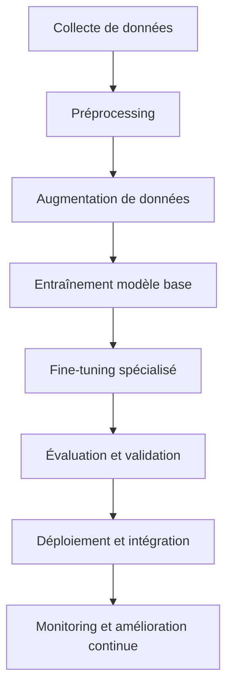

# 🤖 TALKKIN - PLAN D'ENTRAÎNEMENT DES MODÈLES IA

## 🎯 OBJECTIF : MODÈLES IA PERSONNALISÉS POUR LANGUES AUTOCHTONES

**Date :** 25 Juin 2025  
**Statut :** Plan de développement avancé  
**Focus :** Traduction et reconnaissance vocale Maya/Quechua

---

## 🧠 ANALYSE DES BESOINS

### Défis spécifiques aux langues autochtones :
- **Données limitées** : Corpus de texte et audio réduits
- **Variantes dialectales** : Multiples variations régionales
- **Phonétique complexe** : Sons spécifiques non présents dans les modèles génériques
- **Contexte culturel** : Expressions idiomatiques et concepts culturels
- **Qualité audio** : Enregistrements souvent de qualité variable

### Avantages de modèles personnalisés :
- **Précision supérieure** : Adaptés aux spécificités linguistiques
- **Respect culturel** : Préservation des nuances culturelles
- **Performance optimisée** : Modèles légers et rapides
- **Évolution continue** : Amélioration avec nouvelles données

---

## 🔬 TECHNOLOGIES ET APPROCHES RECOMMANDÉES

### 1. TRADUCTION AUTOMATIQUE

#### A. Modèles Transformer personnalisés
```python
# Technologies recommandées
- Hugging Face Transformers
- mT5 (multilingual T5) comme base
- Fine-tuning avec données Maya/Quechua
- Transfer learning depuis modèles similaires
```

#### B. Approches hybrides
- **Modèles de base** : mBERT, XLM-R pour langues peu dotées
- **Fine-tuning** : Adaptation avec corpus Maya/Quechua
- **Augmentation de données** : Techniques de paraphrase et back-translation
- **Modèles ensemblistes** : Combinaison de plusieurs approches

### 2. RECONNAISSANCE VOCALE (ASR)

#### A. Modèles Wav2Vec2 personnalisés
```python
# Technologies recommandées
- Wav2Vec2 de Facebook/Meta
- Whisper d'OpenAI (fine-tuning)
- SpeechT5 pour langues peu dotées
- Modèles CTC (Connectionist Temporal Classification)
```

#### B. Approches spécialisées
- **Transfer learning** : Depuis modèles multilingues
- **Augmentation audio** : Techniques de variation de voix
- **Modèles phonétiques** : Adaptation aux sons spécifiques
- **Post-traitement** : Correction linguistique contextuelle

---

## 📊 DONNÉES NÉCESSAIRES

### Pour la traduction :
- **Corpus parallèles** : 10K-100K paires de phrases FR↔Maya/Quechua
- **Dictionnaires** : Lexiques spécialisés et terminologie
- **Textes monolingues** : Littérature, documents historiques
- **Annotations linguistiques** : POS tagging, syntaxe

### Pour la reconnaissance vocale :
- **Audio + transcriptions** : 100-1000h d'enregistrements
- **Variété de locuteurs** : Différents âges, sexes, régions
- **Qualité audio** : Divers environnements d'enregistrement
- **Annotations phonétiques** : Marquage des sons spécifiques

---

## 🛠️ ARCHITECTURE TECHNIQUE PROPOSÉE

### 1. Pipeline d'entraînement



### 2. Infrastructure recommandée

#### Cloud Computing
- **Google Colab Pro** : Développement et prototypage
- **AWS SageMaker** : Entraînement à grande échelle
- **Azure Machine Learning** : Pipeline MLOps
- **Hugging Face Hub** : Hébergement et versioning des modèles

#### Hardware
- **GPU** : NVIDIA A100 ou V100 pour entraînement
- **TPU** : Google TPU v3/v4 pour modèles Transformer
- **Stockage** : SSD rapide pour datasets volumineux
- **RAM** : 32GB+ pour manipulation de gros modèles

---

## 🔧 IMPLÉMENTATION TECHNIQUE

### Service d'entraînement pour TalkKin

```typescript
/**
 * 🤖 SERVICE D'ENTRAÎNEMENT DE MODÈLES - TALKKIN
 */

interface TrainingConfig {
  modelType: 'translation' | 'asr' | 'tts';
  baseModel: string;
  language: 'maya' | 'quechua';
  datasetPath: string;
  hyperparameters: HyperParameters;
}

interface HyperParameters {
  learningRate: number;
  batchSize: number;
  epochs: number;
  warmupSteps: number;
  gradientAccumulation: number;
}

class ModelTrainingService {
  // Entraînement de modèles de traduction
  async trainTranslationModel(config: TrainingConfig): Promise<ModelMetrics>
  
  // Entraînement de modèles de reconnaissance vocale
  async trainASRModel(config: TrainingConfig): Promise<ModelMetrics>
  
  // Évaluation des performances
  async evaluateModel(modelPath: string, testData: Dataset): Promise<Metrics>
  
  // Déploiement en production
  async deployModel(modelPath: string, endpoint: string): Promise<boolean>
}
```

### Pipeline de données

```python
# Pipeline de préparation des données
class DataPipeline:
    def __init__(self, language='maya'):
        self.language = language
        self.tokenizer = self.load_tokenizer()
    
    def prepare_translation_data(self, corpus_path):
        """Prépare les données pour l'entraînement de traduction"""
        # Nettoyage, tokenisation, alignement
        pass
    
    def prepare_audio_data(self, audio_path):
        """Prépare les données audio pour ASR"""
        # Normalisation, augmentation, feature extraction
        pass
    
    def augment_data(self, data, factor=3):
        """Augmentation de données pour langues peu dotées"""
        # Back-translation, paraphrase, variation audio
        pass
```

---

## 📈 PLAN D'IMPLÉMENTATION PROGRESSIVE

### Phase 1 : Collecte et préparation des données (2-3 mois)
1. **Partenariats académiques** : Universités spécialisées en langues autochtones
2. **Crowdsourcing** : Plateforme de contribution communautaire
3. **Numérisation** : Corpus existants, enregistrements historiques
4. **Nettoyage et annotation** : Préparation pour l'entraînement

### Phase 2 : Modèles de base (1-2 mois)
1. **Fine-tuning mT5** : Pour la traduction FR↔Maya/Quechua
2. **Adaptation Wav2Vec2** : Pour reconnaissance vocale
3. **Évaluation initiale** : BLEU scores, WER, précision
4. **Optimisation** : Hyperparameters tuning

### Phase 3 : Optimisation avancée (2-3 mois)
1. **Modèles ensemblistes** : Combinaison de plusieurs approches
2. **Techniques d'augmentation** : Amélioration avec données synthétiques
3. **Post-traitement** : Correction linguistique contextuelle
4. **Validation communautaire** : Tests avec locuteurs natifs

### Phase 4 : Intégration TalkKin (1 mois)
1. **API de modèles** : Endpoints optimisés
2. **Cache intelligent** : Optimisation des performances
3. **Monitoring** : Métriques de qualité en temps réel
4. **Interface utilisateur** : Confidence scores, alternatives

---

## 🔬 TECHNIQUES AVANCÉES SPÉCIFIQUES

### 1. Few-Shot Learning
```python
# Apprentissage avec peu de données
from transformers import GPT3ForConditionalGeneration

class FewShotTranslator:
    def __init__(self):
        self.model = GPT3ForConditionalGeneration.from_pretrained('gpt-3.5-turbo')
    
    def train_with_examples(self, examples):
        """Entraînement avec quelques exemples seulement"""
        prompt = self.create_few_shot_prompt(examples)
        return self.model.generate(prompt)
```

### 2. Transfer Learning multicouche
```python
# Transfer learning progressif
class ProgressiveTransferLearning:
    def __init__(self, base_model='mT5-base'):
        self.model = self.load_pretrained(base_model)
    
    def freeze_layers(self, n_layers):
        """Gel de certaines couches pour fine-tuning progressif"""
        pass
    
    def progressive_unfreezing(self, schedule):
        """Dégel progressif des couches"""
        pass
```

### 3. Modèles adaptatifs
```python
# Adaptation continue avec nouvelles données
class AdaptiveModel:
    def __init__(self, model_path):
        self.model = self.load_model(model_path)
        self.memory_buffer = []
    
    def online_learning(self, new_data):
        """Apprentissage en ligne avec nouvelles données"""
        self.memory_buffer.append(new_data)
        if len(self.memory_buffer) > threshold:
            self.incremental_update()
```

---

## 🎯 MÉTRIQUES ET ÉVALUATION

### Traduction :
- **BLEU Score** : Qualité de traduction automatique
- **METEOR** : Évaluation sémantique
- **BERTScore** : Similarité contextuelle
- **Évaluation humaine** : Fluence, adéquation, respect culturel

### Reconnaissance vocale :
- **WER (Word Error Rate)** : Taux d'erreur de mots
- **CER (Character Error Rate)** : Taux d'erreur de caractères
- **Confiance** : Scores de confiance des prédictions
- **Robustesse** : Performance dans différents environnements

---

## 💰 BUDGET ET RESSOURCES ESTIMÉS

### Coûts d'infrastructure :
- **Cloud computing** : $2000-5000/mois pendant l'entraînement
- **Stockage données** : $500-1000/mois
- **APIs et services** : $1000-2000/mois

### Ressources humaines :
- **ML Engineer** : Spécialiste en NLP/ASR
- **Linguiste** : Expert langues autochtones
- **Data Scientist** : Préparation et analyse des données
- **Community Manager** : Relations avec communautés autochtones

### Timeline :
- **Développement complet** : 6-9 mois
- **MVP fonctionnel** : 3-4 mois
- **Amélioration continue** : Processus permanent

---

## 🤝 PARTENARIATS STRATÉGIQUES

### Institutions académiques :
- **Universités spécialisées** : Recherche en langues autochtones
- **Instituts linguistiques** : Corpus et expertise
- **Centres culturels** : Validation communautaire

### Organisations technologiques :
- **Hugging Face** : Plateforme de modèles
- **Google AI** : Outils et infrastructure
- **OpenAI** : APIs et modèles de base
- **Mozilla Common Voice** : Données audio ouvertes

### Communautés :
- **Locuteurs natifs** : Validation et amélioration
- **Éducateurs** : Intégration pédagogique
- **Préservateurs culturels** : Guidance éthique

---

## 🔄 INTÉGRATION DANS TALKKIN ACTUEL

### Nouvelles fonctionnalités à ajouter :

```typescript
// Service de modèles personnalisés
class CustomModelService {
  async loadCustomModel(language: string, modelType: string)
  async getTranslation(text: string, confidence: boolean = true)
  async getASRResult(audioData: ArrayBuffer, realTime: boolean = false)
  async getModelMetrics(): Promise<ModelMetrics>
}

// Interface utilisateur améliorée
interface TranslationResult {
  translation: string;
  confidence: number;
  alternatives: string[];
  culturalNotes?: string;
  pronunciationGuide?: string;
}
```

### Composants UI supplémentaires :
- **Confidence indicator** : Affichage de la confiance du modèle
- **Alternative suggestions** : Propositions multiples
- **Cultural context** : Notes contextuelles
- **Pronunciation guide** : Guide de prononciation
- **Quality feedback** : Système de retour utilisateur

---

## 🏆 AVANTAGES CONCURRENTIELS

### Technique :
- **Modèles spécialisés** : Précision supérieure aux solutions génériques
- **Performance optimisée** : Modèles légers pour mobile
- **Amélioration continue** : Apprentissage avec usage
- **Qualité validée** : Vérification par locuteurs natifs

### Culturel :
- **Respect des nuances** : Préservation de l'authenticité
- **Implication communautaire** : Développement participatif
- **Transmission culturelle** : Outil de préservation linguistique
- **Éducation authentique** : Apprentissage culturellement ancré

---

## 🎯 CONCLUSION

**L'entraînement de modèles personnalisés pour TalkKin est non seulement possible, mais essentiel** pour offrir une qualité de service optimale pour les langues autochtones.

### Prochaines étapes recommandées :
1. **Étude de faisabilité détaillée** : 2-3 semaines
2. **Recherche de partenariats** : Universités, communautés
3. **Collecte de données pilote** : Premier corpus de 1000 phrases
4. **Prototype MVP** : Modèle de base en 2-3 mois
5. **Intégration TalkKin** : Version beta avec modèles personnalisés

**Cette approche permettrait à TalkKin de devenir la référence mondiale pour la préservation et l'apprentissage des langues autochtones grâce à l'IA !**

---

*Plan d'entraînement de modèles IA pour TalkKin v2.0*  
*Vers une IA respectueuse et performante pour les langues autochtones*
