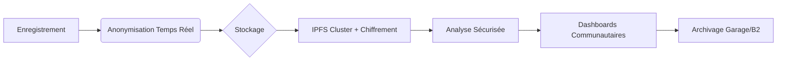

# Architecture d'Anonymisation et Sécurité pour Données Audio/Textuelles

---
## 📚 Glossaire & Encadrés pédagogiques

> **Anonymisation** : Processus qui vise à retirer ou modifier les informations permettant d’identifier une personne dans des données (audio ou texte).

> **FPIC (Free, Prior and Informed Consent)** : Principe garantissant que toute utilisation de données communautaires se fait avec l’accord libre, préalable et éclairé des membres concernés.

> **Exemple concret** :
> - *Avant anonymisation* : « Juan Pérez a enregistré ce conte à Mérida. »
> - *Après anonymisation* : « [Prénom] [Nom] a enregistré ce conte à [Ville]. »

> **À retenir** :
> - L’anonymisation protège la vie privée et le patrimoine culturel.
> - Elle doit être adaptée à chaque contexte et validée par la communauté.

---

## 1. Anonymisation Vocale (Protection de l'Identité)
- **Techniques avancées** :
  - VoiceCloak (PyTorch) : modulation de fréquence pour altérer la signature vocale.
  - Synthèse vocale éthique : remplacement par des voix synthétiques (Coqui TTS) entraînées sur corpus communautaires.
  - Masquage fréquentiel : suppression des fréquences identifiantes avec Librosa.
- **Outils open source** :
  - Harpocrates ANR, PyAnon, Librosa, Coqui TTS.

## 2. Anonymisation Textuelle (Protection des Données Contextuelles)
- **Techniques clés** :
  - Pseudonymisation dynamique (Presidio) : remplacement des noms/lieux par tokens.
  - Généralisation sémantique (NLTK) : agrégation des termes sensibles.
  - Chiffrement homomorphe (TenSEAL) : analyse sans déchiffrement.
- **Outils recommandés** :
  - Presidio, Databunker, NLTK, TenSEAL.

## 3. Sécurité des Données (End-to-End)
| Couche         | Solutions                                 | Outils                   |
|---------------|-------------------------------------------|--------------------------|
| Stockage      | Chiffrement AES-256 + IPFS                | Garage (S3-compatible)   |
| Transit       | Tunnel WireGuard + Let's Encrypt           | Tailscale                |
| Audit         | Logs immuables via Blockchain              | Hyperledger Fabric       |
| Accès         | RBAC + veto communautaire                 | Keycloak + plugins FPIC  |

**Exemple de politique d'accès (Mukurtu CMS)** :
```python
if resource.sensitivity == "sacred":
    require role in ["elder", "shaman"] and fpic_consent_valid()
else:
    require community_member()
```

## 4. Traçabilité et Gouvernance
- Consentement dynamique (QR codes renouvelables)
- Journal blockchain (Hyperledger, smart contracts)
- Dashboard communautaire (Grafana localisé en maya)
- Mukurtu CMS pour gestion des protocoles culturels
- Jetons de gouvernance (NFT) pour votes communautaires

## 5. Bonnes Pratiques Opérationnelles
1. Validation continue : tests mensuels de ré-identification (Amnesia), audits tiers.
2. Formats sécurisés : audio FLAC/Opus (JSON-LD chiffré), texte XML-TEI (balises de sensibilité).
3. Réponse aux incidents : alerte SMS, procédure "burn notice" sur IPFS.

## Stack Technique Recommandée


## Risques et Mitigations
| Risque                        | Solution                                 |
|-------------------------------|------------------------------------------|
| Ré-identification vocale      | Bruitage aléatoire (Librosa)             |
| Fuites de métadonnées         | Nettoyage ExifTool + validation Presidio |
| Ingénierie sociale            | Formation annuelle des locuteurs         |

## Références & Outils
- Harpocrates ANR, Presidio, Hyperledger Fabric
- Checklist OWASP adaptée (version maya)

> "L'anonymisation n'est pas un produit fini, mais un processus continu co-défini avec les communautés."

Cette architecture combine innovations techniques et principes éthiques (FPIC, gouvernance communautaire), pour une protection robuste et respectueuse des traditions mayas.
