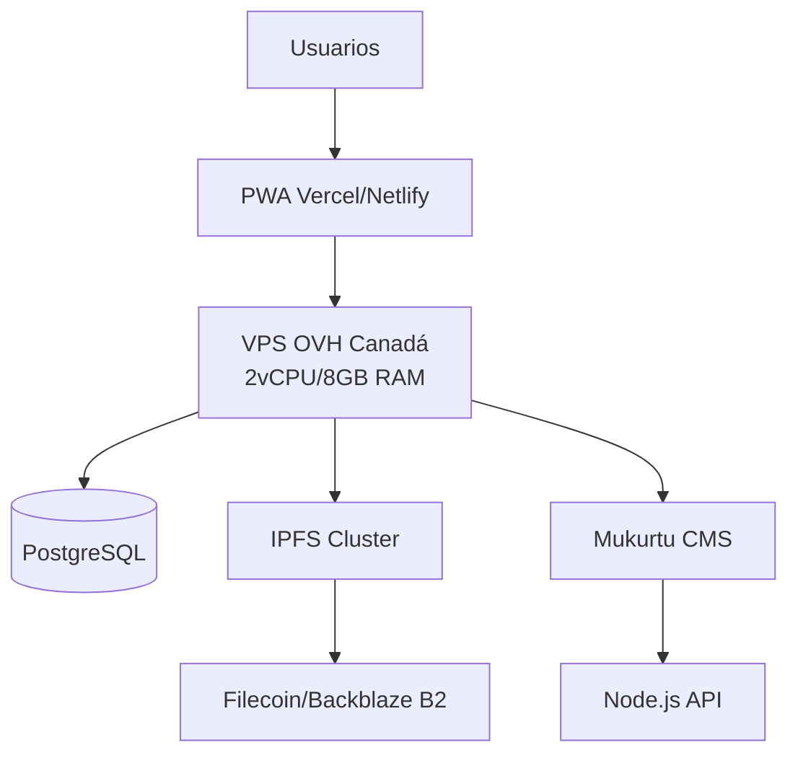

# Arquitectura técnica recomendada – MayaVoiceTranslator (DeepSeek, 2025)

## Esquema global

## Capas y componentes

- **Frontend**: PWA estática (Vercel/Netlify)
- **Backend**: VPS OVH (Node.js, Mukurtu, PostgreSQL, IPFS)
- **Almacenamiento**: IPFS + Backblaze B2 (backups)
- **Seguridad**: Cifrado, RLS, auditoría, protocolos Mukurtu, consentimiento FPIC

## Puntos críticos

| Riesgo                | Solución                                      | Herramienta                |
|-----------------------|-----------------------------------------------|----------------------------|
| Fuga de datos         | Cifrado PostgreSQL, RBAC, RLS                 | pgcrypto, policies         |
| Control comunitario   | Protocolos Mukurtu, consentimiento blockchain | Mukurtu, Hyperledger       |
| Ataques aplicativos   | Validación, Helmet.js, rate limiting          | Express-Validator          |

## Dimensionamiento y costos

| Componente      | Adecuación      | Recomendación complementaria         |
|-----------------|-----------------|--------------------------------------|
| CPU/RAM         | ✅ Suficiente   | Monitorizar con Netdata              |
| SSD             | ⚠️ Limitado    | Añadir Backblaze B2                  |
| Ancho de banda  | ✅ 250Mbps      | Limitar tamaño de subidas de audio   |
| **Costo total** | **≈700€/año**  | VPS + Backblaze + IPFS               |

## Gobernanza

- Comité comunitario, veto sobre nuevas colectas
- Herramientas Loomio, Hyperledger, checklist OWASP traducida

---

*Consulte la guía de instalación para la implementación detallada y la checklist de conformidad.*
