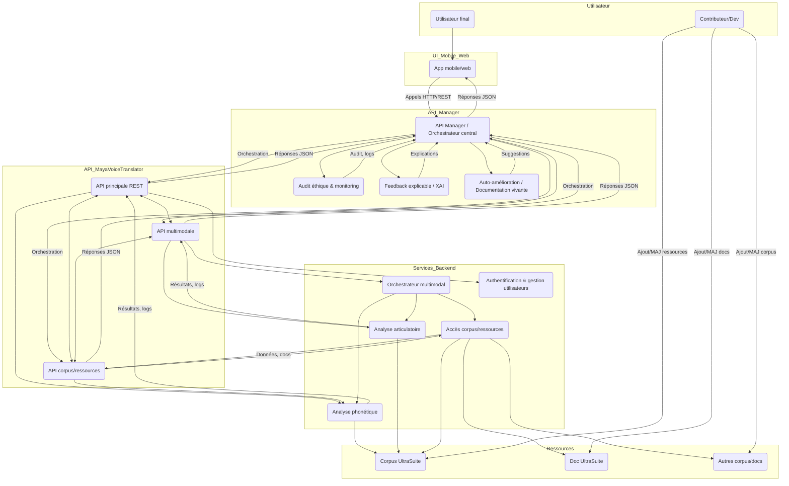

> Ce diagramme enrichi montre l’ajout d’un **API Manager (APIM)** centralisé, orchestrant tous les appels API, intégrant l’audit éthique, le feedback explicable, le monitoring et l’auto-amélioration. Cela garantit modularité, traçabilité, conformité, et innovation continue. Les modules d’audit, feedback, et auto-amélioration sont connectés à l’APIM pour une gouvernance responsable et une amélioration continue.

---

## ⚖️ Principes éthiques de l’IA (Floridi, 2023)

- **Résumé structuré** : Voir `../ethique_ia_floridi.md` (synthèse détaillée des principes, enjeux et recommandations de Floridi)
- **Principes fondamentaux** :
  1. Bienfaisance (promouvoir le bien-être, la dignité, la planète)
  2. Non-malfaisance (ne pas nuire, respect de la vie privée, précaution)
  3. Autonomie (préserver la capacité de décision humaine)
  4. Justice (équité, solidarité, lutte contre les discriminations)
  5. Explicabilité (transparence, responsabilité, traçabilité)
- **Applications dans MayaVoiceTranslator** :
  - Gouvernance éthique des API et services (audit, reporting, conformité)
  - Intégration des principes dans l’UX, l’annotation, l’accessibilité, l’API
  - Outils d’audit, de traçabilité et de feedback explicable
  - Alignement sur les ODD et la transition écologique (empreinte carbone, AI4SG)
- **Interopérabilité** : Structuration des audits et annotations selon les standards (xAI, XAI, LTI, xAPI, etc.)

---
