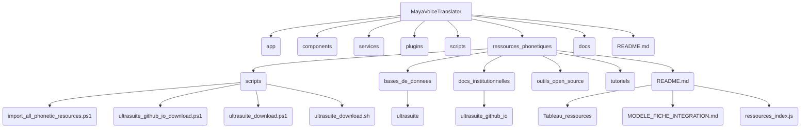

```mermaid
graph TD
  A[MayaVoiceTranslator]
  A --> B(app)
  A --> C(components)
  A --> D(services)
  A --> E(plugins)
  A --> F(scripts)
  A --> G(ressources_phonetiques)
  A --> H(docs)
  A --> I(README.md)

  G --> G1(scripts)
  G --> G2(bases_de_donnees)
  G --> G3(docs_institutionnelles)
  G --> G4(outils_open_source)
  G --> G5(tutoriels)
  G --> G6(README.md)

  G2 --> G2a(ultrasuite)
  G3 --> G3a(ultrasuite_github_io)

  G1 --> G1a(import_all_phonetic_resources.ps1)
  G1 --> G1b(ultrasuite_github_io_download.ps1)
  G1 --> G1c(ultrasuite_download.ps1)
  G1 --> G1d(ultrasuite_download.sh)

  G6 --> G6a(Tableau_ressources)
  G6 --> G6b(MODELE_FICHE_INTEGRATION.md)
  G6 --> G6c(ressources_index.js)
```

> Ce code Mermaid corrige les crochets par des parenthèses pour la compatibilité avec la syntaxe Mermaid standard.
